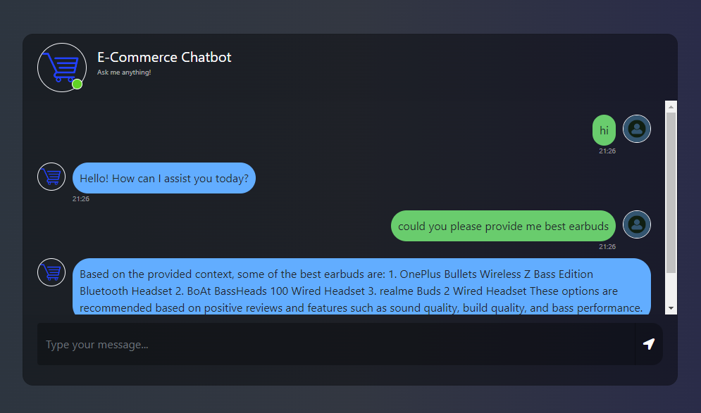

# Ecommerce Chatbot

Welcome to the Ecommerce Chatbot project! This chatbot is designed to assist users with their online shopping experience by providing product recommendations, answering questions, and assisting with various inquiries related to the ecommerce store.

## Overview

The Ecommerce Chatbot is built using Python and Flask framework. It leverages natural language processing (NLP) techniques to understand user queries and generate appropriate responses. The chatbot integrates with the ecommerce store's product database to provide personalized recommendations and information about available products.

This project uses:

- Model: OpenAI models for generating responses.
- Framework: LangChain for handling conversational flows and integrations.
- Database: Datavade Astra DB for storing product and user data.

## Features

- Interactive chat interface for users to interact with the chatbot.
- Natural language processing for understanding user queries.
- Product recommendation engine based on user preferences and browsing history.
- Integration with the ecommerce store's product database.
- Ability to handle various user inquiries such as product availability, pricing, shipping information, etc.



## Dataset
The dataset used for product recommendations and other features follows the format:


- product_id: Unique identifier for each product.
- product_title: Name or title of the product.
- rating: User rating for the product (e.g., 1-5 stars).
- summary: A brief summary of the product review.
- review: The full text of the user's review.

This dataset is used to generate personalized recommendations and handle user inquiries about products.

## Installation

To set up the Ecommerce Chatbot locally, follow these steps:

1. Clone the repository to your local machine:
```
   git clone https://github.com/SandeepKR23/ecommerce-chatbot.git
```

2. Navigate to the project directory:
```
   cd ecommerce-chatbot
```

3. Environment setup and Install the required Python packages using pip:
```
python -m venv .venv  
.\.venv\Scripts\activate

pip install -r requirements.txt
```

4. Set up environment variables:
- Create a .env file in the project directory.
- Define the necessary environment variables such as database connection strings, API keys, etc.
  
5. Run the Flask application:
```
python app.py
```
